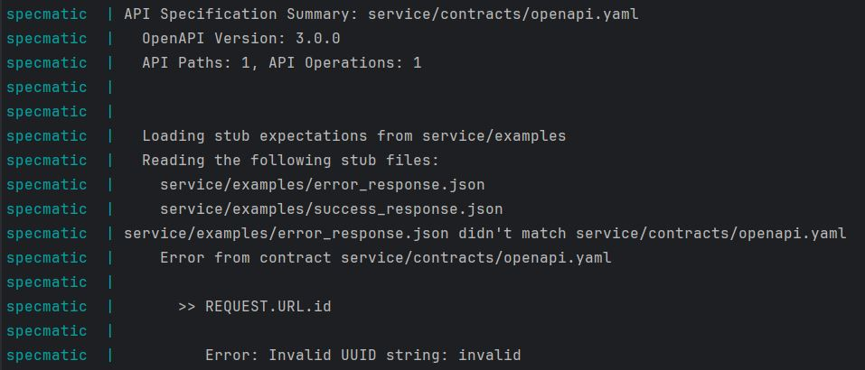

#### Description:

Specmatic seems to reject external examples containing query parameters \
that violate the spec even though the status code indicates an error.

<br/>

#### Minimal Example:

🧾 OpenAPI specification:

```yaml
openapi: 3.0.0

info:
  title: Users Service
  version: 1.0.0

servers:
  - url: http://localhost:9000

paths:
  /find-user:
    get:
      parameters:
        - in: query
          name: id
          required: true
          schema:
            type: string
            format: uuid
      responses:
        200:
          description: user found
        400:
          description: validation error
```

✔️ Example that works:

```json
{
  "http-request": {
    "path": "/find-user",
    "method": "GET",
    "query": {
      "id": "4cee792f-6a93-43ec-80c7-a4f2e4e9ed49"
    }
  },
  "http-response": {
    "status": 200
  }
}
```

❌  Example that fails:

```json

{
  "http-request": {
    "path": "/find-user",
    "method": "GET",
    "query": {
      "id": "invalid"
    }
  },
  "http-response": {
    "status": 400
  }
}
```

💻 Error:



<br/>

#### Steps To Reproduce:

- clone this repository
- execute docker compose up
- check the logs of the specmatic container
